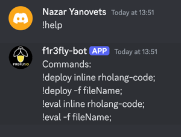
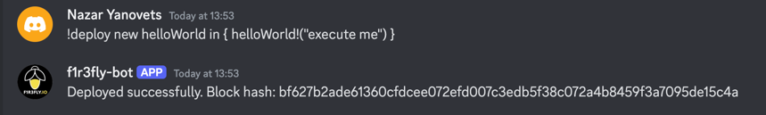
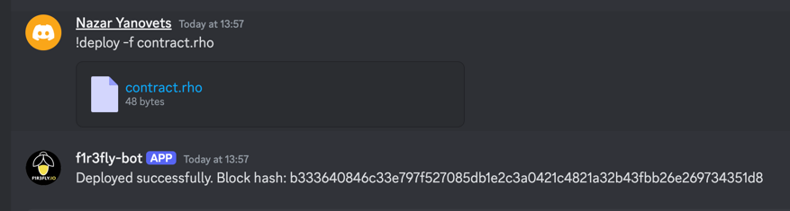
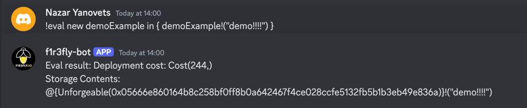
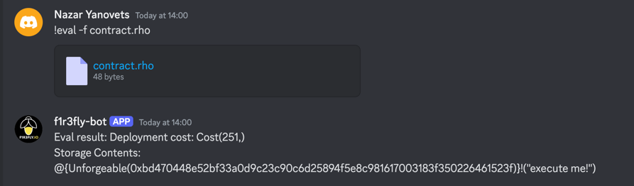

## Basic Discrod bot for F1R3FLY.io!

Project for discrod bot that can communicate with the f1r3fly platform.

## Local development:

So, generally you should build communication between discord bot(jar or docker) and f1r3fly(jar or cloud).[](https://)
Make bot .jar file from root folder:

```angular2html
./gradlew clean shadowJar --rerun-tasks  
```

Run bot .jar file with environment variables:

```angular2html
step1:  
export DISCORD_BOT_TOKEN=your_token 
export GRPC_NODE_HOST=your_host  
export GRPC_NODE_PORT=your_port  
export RHOLANG_SIGNING_KEY=your_signing_key
   
step2:  
java -Ddiscord.bot.token=$DISCORD_BOT_TOKEN \ -Dgrpc.node.host=$GRPC_NODE_HOST \  
-Dgrpc.node.port=$GRPC_NODE_PORT \  
-Drholang.signing.key=$RHOLANG_SIGNING_KEY \  
-jar build/libs/F1r3flyBots-1.0-SNAPSHOT-shadow.jar  
```

You can also run the bot with docker: after you make a fat jar with shadowJar command you can run the next command to build a docker image:

```angular2html
./gradlew buildDockerImage  
```

and then run

```angular2html
docker run -d --name f1r3fly-discord-bot \                                                                                                 
-e DISCORD_BOT_TOKEN=your_token \  
-e GRPC_NODE_HOST=your_host \  
-e GRPC_NODE_PORT=your_port \  
-e RHOLANG_SIGNING_KEY=your_signing_key \  
f1r3fly-discord-bot:latest  
```

## Connection with Oracle clusters:

Communication with the oracle. On Oracle, we have several clusters, for communication (deployment) on the Oracle cluster, we need to substitute the IP address of the node from the cluster, as well as the 30002 port in the docker or fat jar launch command.
Example with docker:

```angular2html
docker run -d --name f1r3fly-discord-bot \                                                                                                 
-e DISCORD_BOT_TOKEN=your_token \  
-e GRPC_NODE_HOST=NODE_IP_ADRESS \  
-e GRPC_NODE_PORT=30002 \  
-e RHOLANG_SIGNING_KEY=your_signing_key \  
f1r3fly-discord-bot:latest  
```

## Supported commands:

1. `!help`
   
2. `!deploy inline rholang-code`
   
3. `!deploy -f fileName`
   
4. `!eval inline rholang-code`
   
5. `!eval -f fileName`
   

## TODO:

1. When the compiler can convert meTTa code into rholang code, add -l (language) flag to !deploy and !eval commands, but
2. Create X(Twitter) bot.
